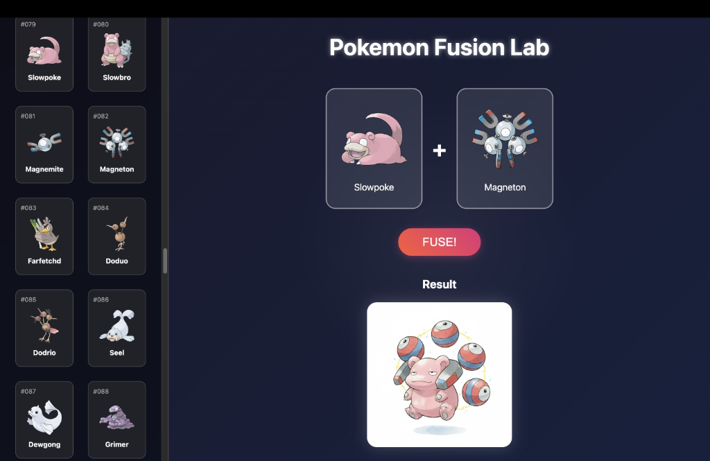

# Pokemon Fusion Lab / 寶可夢融合實驗室



[English](#english) | [中文](#chinese)

<a name="english"></a>
## 🇬🇧 English

A web application that allows you to fuse Generation 1 Pokemon using Google's Gemini AI.

### Features
- **Gen 1 Collection**: Browse all original 151 Pokemon.
- **Drag & Drop**: Intuitive interface to select Pokemon for fusion.
- **AI Generation**: Uses Google Gemini 2.5 Flash Image model to create high-quality, Ken Sugimori style fusions.
- **BYOK (Bring Your Own Key)**: Securely use your own Google API Key.

### Setup

1.  **Clone the repository**
    ```bash
    git clone https://github.com/ts003428300/pokemon-fusion.git
    cd pokemon-fusion
    ```

2.  **Start Backend**
    ```bash
    cd backend
    python3 -m venv venv
    source venv/bin/activate  # Windows: venv\Scripts\activate
    pip install -r requirements.txt
    uvicorn main:app --reload
    ```

3.  **Start Frontend**
    ```bash
    cd frontend
    npm install
    npm run dev
    ```

4.  **Open Browser**
    Go to `http://localhost:5173`. You will be prompted to enter your Google Gemini API Key.

---

<a name="chinese"></a>
## 🇹🇼 中文

這是一個使用 Google Gemini AI 來融合初代寶可夢的網頁應用程式。

### 功能特色
- **初代圖鑑**: 瀏覽完整的 151 隻初代寶可夢。
- **拖放介面**: 直覺的拖拉操作來選擇要融合的寶可夢。
- **AI 生圖**: 使用 Google Gemini 2.5 Flash Image 模型，生成高品質、杉森建畫風的融合寶可夢。
- **自帶 Key**: 安全地使用您自己的 Google API Key。

### 安裝教學

1.  **下載專案**
    ```bash
    git clone https://github.com/ts003428300/pokemon-fusion.git
    cd pokemon-fusion
    ```

2.  **啟動後端**
    ```bash
    cd backend
    python3 -m venv venv
    source venv/bin/activate  # Windows: venv\Scripts\activate
    pip install -r requirements.txt
    uvicorn main:app --reload
    ```

3.  **啟動前端**
    ```bash
    cd frontend
    npm install
    npm run dev
    ```

4.  **開啟瀏覽器**
    前往 `http://localhost:5173`。首次進入時，系統會提示您輸入 Google Gemini API Key。
